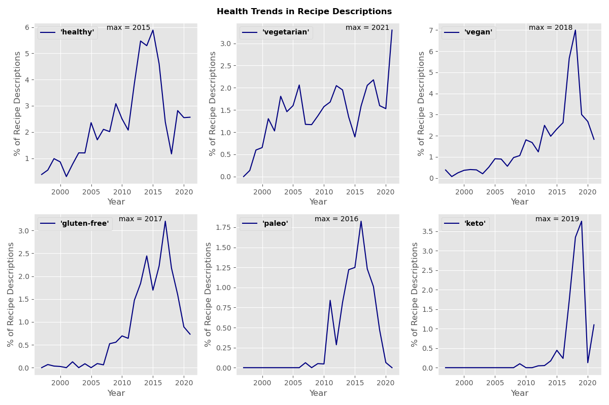
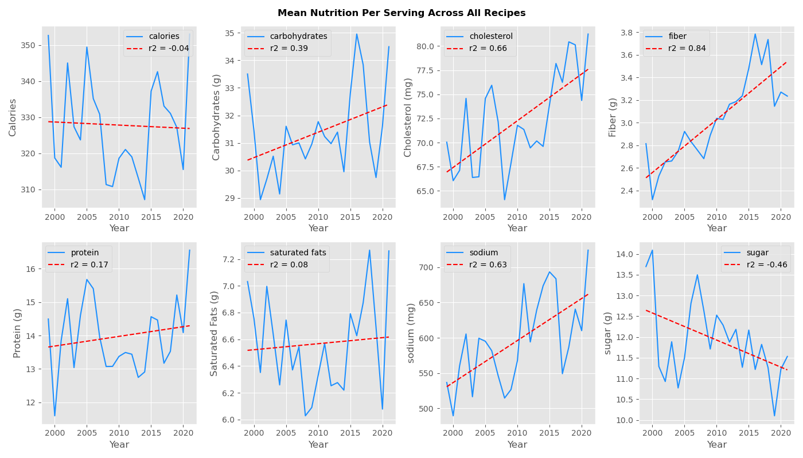
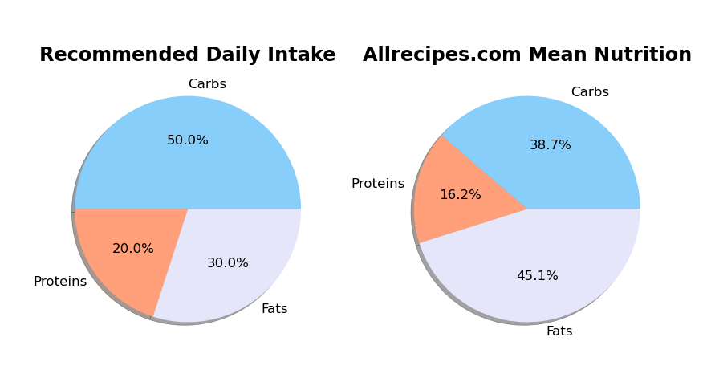
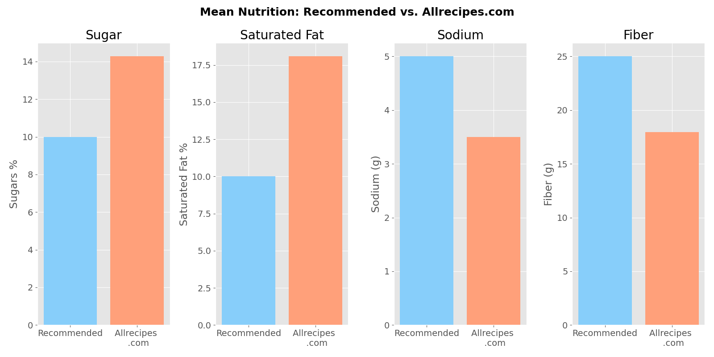
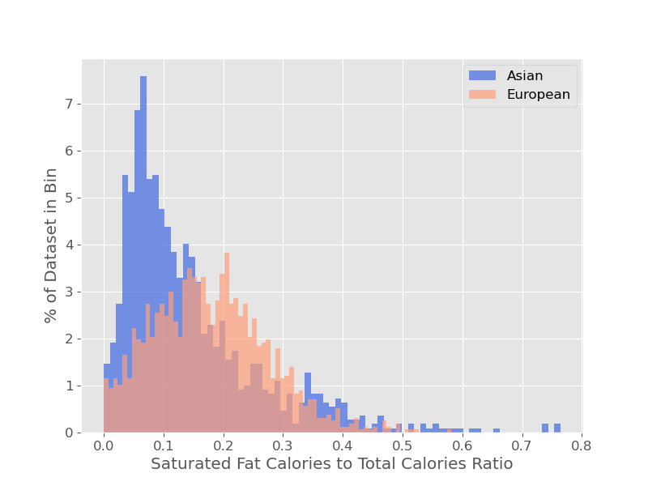

# Health Trend Analysis of Recipe Pages From Allrecipes.com

## Introduction

Unhealthy dietary practices are linked to health risks such as malnutrition, diabetes, heart disease, stroke, and cancer [1]. The goal of this exploratory data analysis is to determine whether there are measurable trends in nutrition from recipes on Allrecipes.com, and whether the average nutrition content of the recipes aligns with recommended nutrition. 

The World Health Organization recommends that [1]:

* Total fat should not exceed 30% of total daily calorie intake
* Saturated fats should not exceed 10% of total daily calorie intake 
* Added sugars should not exceed 10% of total daily calorie intake, while 5% is suggested for additional health benefit
* Salt intake should be less than 5g per day

### CRISP-DM Process

Business understanding – A business centered on healthy eating and recipes could use this data to increase how they prioritize nutrition in their own recipes and see what recipe features result in higher user engagement.

Data understanding – This dataset provides data from over 38,000 recipes on the largest and most viewed recipe website (Allrecipes.com)

Data preparation – Data was cleaned to remove null values and reformatted to be easy to use. 

Modeling – Exploratory data analysis and hypothesis testing was applied to see whether recipes meet nutrition guidelines and whether recipe category affects nutrition.

Evaluation – The hypothesis testing would best serve a company's business goals by allowing them to compare which types of recipes influence different nutritional components.

Deployment – The hypothesis testing could be implemented in a tool for users to see where their recipe scores in various nutritional areas, helping them make healthy dietary choices and improving user engagement.

## Data Preparation

All data used in this analysis comes from recipe web pages scraped from Allrecipes.com. Allrecipes.com was founded in the year 1997, so recipes in the dataset span the time period of 1997 - 2021. Web pages were scraped using the allrecipes_scraper.py script in this repository. The scraped html pages were then tabulated into a Pandas dataframe using the create_dataframe.py script in this repo. An example of 100 rows of recipe data is available in this repo, named dataframe_example.csv.

The data was cleaned using the clean_dataframe function in the data analysis notebook, titled recipeEDA_notebook.ipynb. Data cleaning included removing null valued columns, removing any rows not of the 'recipe' type, removing any duplicate rows, reformats columns as necessary, converting date strings to timestamps, etc. 

The final dataframe contains: 
* 38096 rows (recipes)
* 61 columns (information for each recipe)

Information in columns includes:
* the url of the original webpage for each recipe
* recipe name
* description
* prep time/cook time
* created date
* ingredients
* recipe instructions
* recipe categories
* recipe reviews and ratings
* nutrition (per serving calories, fat, protein, sugar, fiber, etc.)
* nlp sentiment data from Allrecipes.com
* etc.

## Data Analysis and Results

### Health-Related Keywords in Recipe Descriptions

The dataframe was divided by year, and the description column was searched for keywords related to healthy eating or popular diets. Keywords such as 'healthy', 'vegetarian', 'vegan', 'gluten-free', 'paleo', and 'keto' were plotted to show trends over time. Overall, recipes showed an upward trend for the 'healthy', 'vegetarian', and 'vegan' keywords, and sharp peaks for the 'gluten-free', 'paleo', and 'keto' keywords which indicate these were diet trends which were popular in certain years. 

### Nutrition Information Over Time

To determine if there were any broad trends in recipe nutrition content over time, the mean nutrition per recipe for all recipes was calculated and plotted per year. Calories and macronutrients such as carbohydrates, protein, and saturated fats don't show strong trends over time, but some nutrition components such as choleseterol, fiber, and sodium displayed upward trends while sugar showed a downward trend. 

### Daily Macronutrients: Recommended vs. Allrecipes.com Mean

Harvard Medical School recommends that adults get an an average of 50% of their calories from carbohydrates, 30% of their calories from fat, and 20% of their calories from protein daily [2].

In this Allrecipes.com analysis, the mean nutrition across all recipes in the dataset was calculated. The ratio of mean macronutrients to calories was calculated and compared against the recommended values.

In addition to macronutrients, other nutritional values were analyzed. Since serving size is not defined for each recipe, we assumed a 2000 calorie diet for an adult and calculated the number of servings per day where the mean was 323.19 calories per serving. Using this ratio, we calculated the grams of sugar, saturated fat, sodium, and fiber per day and compared these to the recommended amounts.

 

### Recipe Categories Over Time

The recipes in this dataset are grouped into 1,170 unique categories. Categories of recipes for each year of the dataset were calculated and compiled into a csv file to create a bar chart 'race' animation to depict the prevalence of the top categories over time.

The bar chart race animation created using this data can be found here: https://public.flourish.studio/visualisation/5380666/

The top 10 categories of recipes overall were: 

* Dessert Recipes (6824 recipes)
* Side Dish (4618 recipes)
* World Cuisine Recipes (3690 recipes)
* Main Dish Recipes (2984 recipes)
* Appetizers and Snacks (2920 recipes)
* Soups (2741 recipes)
* Stews and Chili Recipes (2740 recipes)
* Meat and Poultry Recipes (2658 recipes)
* Salad (2006 recipes)
* Vegetables (1944 recipes)

### Hypothesis Testing

Hypothesis testing was conducted to determine whether the category of the recipes had an influence on a variety of different nutrition values such as saturated fat, protein, and fiber. 

#### Example Hypothesis

H0: That recipe category does not influence the saturated fat calories to total calories ratio.
HA: That the recipes in the 'European' category will have a different saturated fat calories to total calories ratio than the 'Asian' category.

Test: A two-tailed t-test was chosen, since we are interested in both ends of the distribution.
Alpha: A significance level of 0.05 was chosen for this test, since this is generally standard and the outcome of this hypothesis testing is not 

  

Asian recipe category: mean 0.145, variance 0.014
European recipe category: mean 0.178, variance 0.009

For this hypothesis test, the t-statistic is -7.6434898260482935, and the p value is 3.241899360589286e-14.
Since the p-value is less than the significance level 0.05, we can reject the null hypothesis that recipe category for these categories does not affect the saturated fat calories to total calories ratio. 

## Conclusions

The recipes scraped from Allrecipes.com show some trends in nutrition and dietary keywords over time. Overall, the average cholesterol, sodium, and fiber in recipes is increasing, while sugar content is declining. Recipe description keywords such as 'healthy', 'vegetarian', and 'vegan' have increased over time, while 'gluten-free', 'paleo', and 'keto' had sharp peaks in usage indicating that they were popular fad diets. The average macronutrient to calorie ratio across all recipes in the dataset is higher in total fat content than the recommended daily values (45.1% to 30% recommended), the protein content is lower than recommended (16.2% to 20% recommended), and the carbohydrate content is lower than recommended (38.7% to 50% recommended). Additionally, sugar, sodium, and saturated fat percentages were higher than recommended, while fiber was less than the recommended value. To get the recommended daily nutrients, a site content consumer would want to seek out recipes with lower fat and saturated fat content, lower sugar, and higher fiber. 

## References

[1] https://www.who.int/news-room/fact-sheets/detail/healthy-diet

[2] https://www.health.harvard.edu/staying-healthy/dietary-guidelines-and-caloric-percentages

